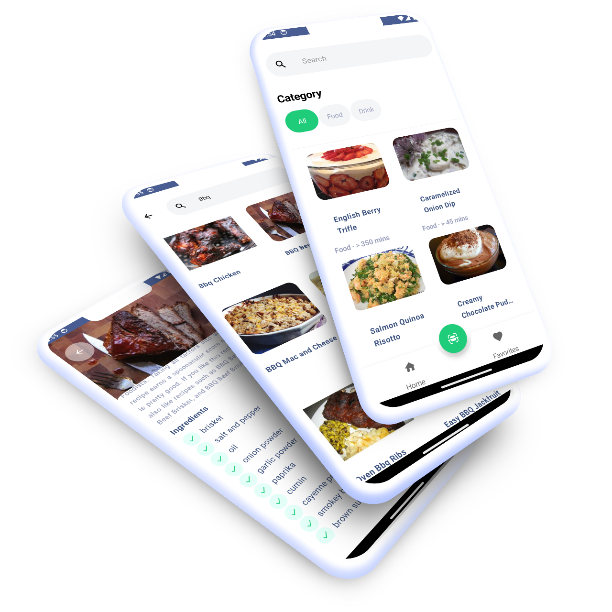
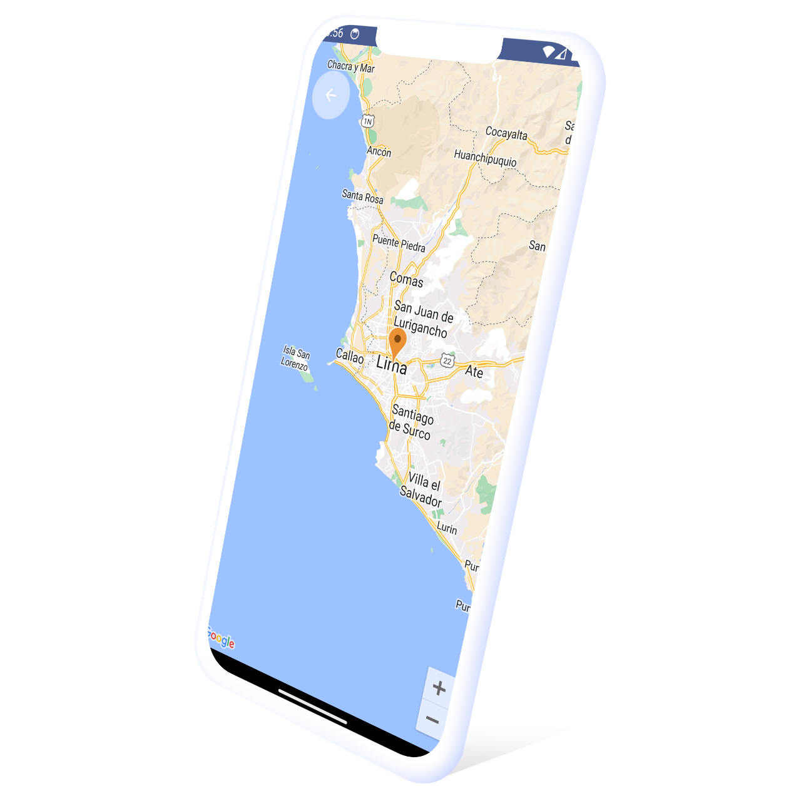

## Introduction

This is the solution to a Recipe app as part of a challenge proposed by **Yape**

## Screenshots 

| Home & Detail | Map |
|--|--|
|  |  |

### Requirements

The application must contain the following screens:

-   **Home Screen:**  Lists available recipes and a search bar.
-   **Detail Screen:**  Displays detailed information about a selected recipe.
-   **Map Screen:**  Shows the location of the selected recipe.

## Solution

The app makes use of Clean Architecture to separate the application's logic into layers. The presentation layer displays the information to the user, the domain layer manages business logic, and the data layer handles data access.

The MVVM pattern separates the view logic from the application logic. The view presents information to the user, and the application logic provides information to the view.

Flows are used to manage the request of the data outside the main thread

The proposal takes advantage of Compose to build the user interface.

## Good Practices

The application implements the Android version catalog to ensure compatibility with the latest Android versions.

Gradle KTS is used to write the application's build script.

## Automated Tests

The application includes automated tests for verifying the application's logic.

## Areas for Improvement

The application could be enhanced in the following areas:

-   Abstraction of the HTTP client in  `ktorClientImpl`.
-   Addition of an interceptor to detect network status changes before making a request.
-   Unit tests for  `ktorClientImpl`.
-   Implementation of database persistence.
-   Interface segregation in  `LocalDataSource`.
-   Improvement of test object creation with a factory method.

## Used Libraries

The application utilizes the following libraries:

-   `ktor`  for backend communication.
-   `coil`  for image loading.
-   `navigation`  for screen navigation.
-   `maps`  for displaying maps.
-   `dagger`  for dependency injection.
-   `turbine`  for debugging flows.
-   `coroutines`  for asynchronous programming.
-   `kotest`  for automated testing.

## UX/UI

The UX/UI was inspired by the following [design](https://www.figma.com/file/cmkyr61FnL72Qd1pLkf3bS/Recipeo---Recipe-App-UI-%28Community%29?mode=dev) hosted by Figma and all the rights belong to its creator, this app does not have the intention to be published on any Marketplace Store.
